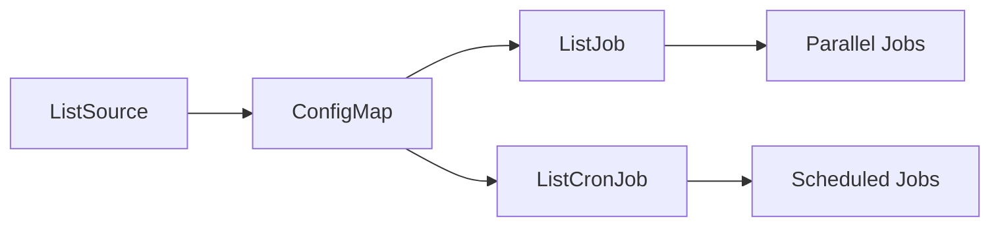

# Parallax Operator

[](https://github.com/matanryngler/parallax/actions/workflows/ci.yml)
[](https://opensource.org/licenses/Apache-2.0)

A Kubernetes operator for parallel batch processing that enables you to process lists of items concurrently using various data sources.

## 🎯 Overview

Parallax allows you to:
- **Fetch lists** from multiple sources (static lists, REST APIs, PostgreSQL databases)
- **Process items in parallel** using Kubernetes Jobs
- **Schedule recurring processing** with CronJobs
- **Scale dynamically** based on list size

## 🏗️ Architecture

Parallax defines three custom resources:

- **ListSource**: Defines where to fetch your list of items
- **ListJob**: Creates Kubernetes Jobs to process each item in parallel
- **ListCronJob**: Schedules ListJobs to run on a cron schedule



## 🚀 Quick Start

### Installation

#### Option 1: Helm (Recommended)
```bash
# Install from GitHub releases (latest version)
helm install parallax https://github.com/matanryngler/parallax/releases/download/v0.1.0/parallax-0.1.0.tgz

# Or install from source
git clone https://github.com/matanryngler/parallax.git
cd parallax
helm install parallax ./charts/parallax
```

#### Option 2: Separate CRDs (Advanced)
For environments where CRDs are managed separately:
```bash
# Step 1: Install CRDs
helm install parallax-crds https://github.com/matanryngler/parallax/releases/download/v0.1.0/parallax-crds-0.1.0.tgz

# Step 2: Install operator (without CRDs)
helm install parallax https://github.com/matanryngler/parallax/releases/download/v0.1.0/parallax-0.1.0.tgz --set installCRDs=false
```

#### Option 3: kubectl (Direct)
```bash
# Apply all manifests directly (when available)
kubectl apply -f https://github.com/matanryngler/parallax/releases/latest/download/parallax.yaml
```

📖 **See [charts/README.md](charts/README.md) for detailed installation options and configuration.**

### Basic Example

1. **Create a ListSource:**
```yaml
apiVersion: batchops.io/v1alpha1
kind: ListSource
metadata:
  name: fruit-list
spec:
  type: static
  staticList:
    - apple
    - banana
    - orange
  intervalSeconds: 300  # Update every 5 minutes
```

2. **Create a ListJob to process the items:**
```yaml
apiVersion: batchops.io/v1alpha1
kind: ListJob
metadata:
  name: fruit-processor
spec:
  listSourceRef: fruit-list
  parallelism: 3
  template:
    image: busybox
    command: ["echo", "Processing fruit: $ITEM"]
    envName: ITEM
    resources:
      requests:
        cpu: "100m"
        memory: "128Mi"
```

3. **Apply the resources:**
```bash
kubectl apply -f listsource.yaml
kubectl apply -f listjob.yaml
```

## 📋 Data Sources

### Static Lists
```yaml
spec:
  type: static
  staticList:
    - item1
    - item2
    - item3
```

### REST API
```yaml
spec:
  type: api
  api:
    url: "https://api.example.com/items"
    jsonPath: "$.data[*].id"
    headers:
      Authorization: "Bearer token"
```

### PostgreSQL Database
```yaml
spec:
  type: postgres
  postgres:
    host: "postgres.example.com"
    port: 5432
    database: "mydb"
    query: "SELECT id FROM items WHERE active = true"
    usernameSecret:
      name: postgres-credentials
      key: username
    passwordSecret:
      name: postgres-credentials
      key: password
```

## 🔄 Scheduling with ListCronJob

```yaml
apiVersion: batchops.io/v1alpha1
kind: ListCronJob
metadata:
  name: daily-processor
spec:
  listSourceRef: my-list-source
  schedule: "0 2 * * *"  # Daily at 2 AM
  parallelism: 5
  template:
    image: my-processor:latest
    command: ["./process"]
    envName: ITEM
  concurrencyPolicy: Forbid
  successfulJobsHistoryLimit: 3
  failedJobsHistoryLimit: 1
```

## 🛠️ Development

### Prerequisites
- Go 1.23+
- Docker
- Kubernetes cluster (for testing)
- Make

### Building and Testing

```bash
# Quick CI checks (tests + linting)
make ci-quick

# Run all CI checks locally (matches GitHub Actions)
make ci-all

# Unit tests
make test                       # Run unit tests with coverage

# E2E tests (see CONTRIBUTING_E2E.md for details)
make test-e2e                   # Full E2E: setup + test + cleanup
make test-e2e-quick            # Quick E2E: test existing cluster

# Build the operator
make build

# Run locally (requires kubeconfig)
make run

# Build and push docker image
make docker-build docker-push IMG=my-registry/parallax:tag
```

### Testing Philosophy

**🔒 Isolated Testing**: Tests never touch your production resources
- Unit tests run completely offline
- E2E tests create dedicated Kind clusters (`parallax-e2e-test`)  
- All test clusters are automatically cleaned up
- No accidental impact on your real Kubernetes clusters

**🚀 Local CI**: Run the same checks as GitHub Actions
```bash
# Quick feedback loop
./scripts/pre-commit.sh

# Or use Make targets
make ci-quick      # Fast: tests + linting
make ci-all        # Complete: all CI checks
```

### Project Structure
```
├── api/v1alpha1/          # CRD definitions
├── internal/controller/   # Controller implementations
├── config/               # Kubernetes manifests
├── charts/parallax/      # Helm chart
├── test/                 # E2E tests
└── samples/              # Example configurations
```

## 🔧 Configuration

### Environment Variables

| Variable | Description | Default |
|----------|-------------|---------|
| `METRICS_BIND_ADDRESS` | Metrics server bind address | `:8080` |
| `LEADER_ELECT` | Enable leader election | `false` |
| `LOG_LEVEL` | Log level (debug, info, warn, error) | `info` |

### Resource Requirements

**Minimum:**
- CPU: 100m
- Memory: 128Mi

**Recommended:**
- CPU: 500m
- Memory: 256Mi

## 📊 Monitoring

The operator exposes Prometheus metrics on `/metrics`:

- `parallax_listsource_items_total` - Total items fetched by ListSource
- `parallax_listjob_duration_seconds` - Time taken to process ListJobs
- `parallax_errors_total` - Total errors encountered

## 🔒 Security

- Supports RBAC with minimal required permissions
- Secrets are handled securely for database connections
- Container images are signed with cosign
- Regular security scanning with Gosec

## 🤝 Contributing

We welcome contributions! Please see [CONTRIBUTING.md](CONTRIBUTING.md) for details.

1. Fork the repository
2. Create a feature branch: `git checkout -b feature/my-feature`
3. Commit changes: `git commit -am 'Add my feature'`
4. Push to the branch: `git push origin feature/my-feature`
5. Create a Pull Request

## 📝 License

This project is licensed under the Apache License 2.0 - see the [LICENSE](LICENSE) file for details.

## 🆘 Support

- 📖 [Documentation](https://github.com/matanryngler/parallax/wiki)
- 💬 [Discussions](https://github.com/matanryngler/parallax/discussions)
- 🐛 [Issues](https://github.com/matanryngler/parallax/issues)

## ⭐ Star History

[](https://star-history.com/#matanryngler/parallax&Date)